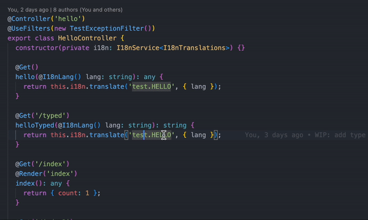

# Type safety

`nestjs-i18n` can generate types! This way your translations will be completely type safe! 🎉



To use generated types specify the `typesOutputPath` option to let `nestjs-i18n` know where to put them.

```typescript title="src/app.module.ts"
import { Module } from '@nestjs/common';
import * as path from 'path';
import { I18nModule } from 'nestjs-i18n';

@Module({
  imports: [
    I18nModule.forRoot({
      fallbackLanguage: 'en',
      loaderOptions: {
        path: path.join(__dirname, '/i18n/'),
        watch: true,
      },
      typesOutputPath: path.join(__dirname, '../src/generated/i18n.generated.ts'),
    }),
  ],
  controllers: [],
})
export class AppModule {}
```

> The `typesOutputPath` should also be added to `eslintignore` to prevent linting errors.

# Usage

To use the types within your code import the `I18nTranslations` type from the generated file. Pass this type into the generic type properties of the `I18nContext` or `I18nService`.

```typescript title="src/app.controller.ts"
import { Controller, Get } from '@nestjs/common';
import { I18n, I18nContext } from 'nestjs-i18n';
import { I18nTranslations } from './generated/i18n.generated.ts';

@Controller()
export class AppController {

  @Get()
  async getHello(@I18n() i18n: I18nContext<I18nTranslations>) {
    return await i18n.t('test.HELLO');
  }
}
```

:::tip
You can import the `I18nPath` type so you require a valid i18n path in your code. This is useful when handeling exceptions with translations.

```typescript title="src/app.controller.ts"
import { I18nPath } from './generated/i18n.generated.ts';

export class ApiException extends Error {
  get translation(): I18nPath {
    return this.message as I18nPath;
  }

  get args(): any {
    return this._args;
  }

  constructor(key: I18nPath, private readonly _args?: any) {
    super(key);
  }
}
```
:::

:::caution
For now type safety is optional and need to be enabled. We're planning to make a breaking change where type safety is enabled by default.
:::

# Type safety with DTOS

You can also use the generated types in your DTOs. This way you can reduce the chance of having a typo in your validation messages.

```typescript title="src/craete-user.dto.ts"
import { I18nTranslations } from './generated/i18n.generated.ts';
import {
  IsEmail,
  IsNotEmpty,
} from 'class-validator';
import { i18nValidationMessage } from 'nestjs-i18n';

export class CreateUserDto {
  @IsNotEmpty({ message: i18nValidationMessage<I18nTranslations>("validation.isNotEmpty")})
  @IsEmail({}, { message: i18nValidationMessage<I18nTranslations>("validation.isEmail")})
  email: string;

  @IsNotEmpty({ message: i18nValidationMessage<I18nTranslations>("validation.isNotEmpty")})
  password: string;

}

```
